# South Australia Solar Supply Forecast

---

This project aims to forecast energy supply from solar photovoltaic (PV) in South Australia. This is my first attempt at exploring Energy and Environmental topic, and may yield useful information to anticipate potential grid volatility.

### Data Source

Our data is collected with [OpenNEM API](https://opennem.org.au/) and [Open Meteo API](https://open-meteo.com/), made available under [CC BY 4.0 License](https://creativecommons.org/licenses/by/4.0/).

### Analysis Tool

We will be using Python 3 (Numpy, Pandas, Matplotlib) and [Nixtla's StatsForecast](https://nixtlaverse.nixtla.io/statsforecast/) library in this project.

---

## Importing File

We import the file `extracted.csv` which is extracted from OpenNEM and Open Meteo's API. The extracting script can be found as `script_etl.py` on the same folder, which samples the daily data from 5 January 2019 to 5 January 2024 for various solar plants in South Australia.

Albeit sometimes considered data leaking, looking at the general plots seem to be so quintessential in time series analysis for detecting error that I decided not to put verification data at least for this part.


```python
import numpy as np
import pandas as pd
import matplotlib.pyplot as plt

import os
from os.path import isfile
import pickle

# Import data
sol = pd.read_csv("sol_data.csv")

# Select the data from establishment dates (actually should be in ETL)
for name in sol["Name"].unique():
    start_date_idx = sol[sol["Name"] == name].index[0]
    est_date_idx = sol[(sol["Name"] == name) & (sol["Energy"] > 0)].index[0]
    sol.drop(index = list(range(start_date_idx, est_date_idx)), inplace=True)

# Preview plot
for name in sol["Name"].unique():
    plt.close()
    df = sol[sol["Name"] == name]
    df.loc[:, 'Date'] = pd.to_datetime(df["Date"], yearfirst=True).dt.strftime('%m/%y') # only change format for this loop
    df.plot(x='Date', y='Energy', label=name)
    plt.title("Solar PV Generated Energy")
    plt.legend()
    plt.show()
```


    
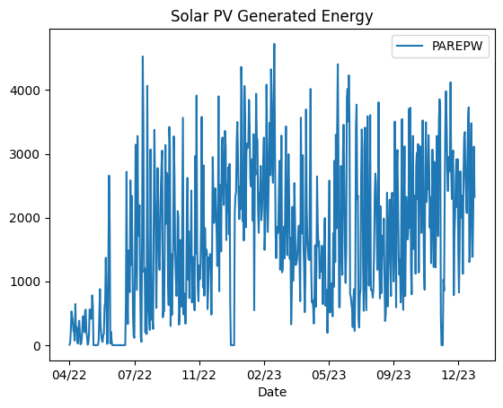
    


    
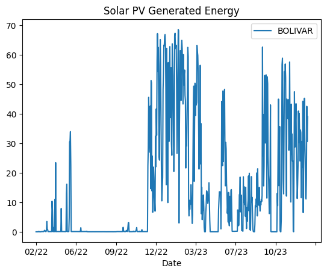
    


    
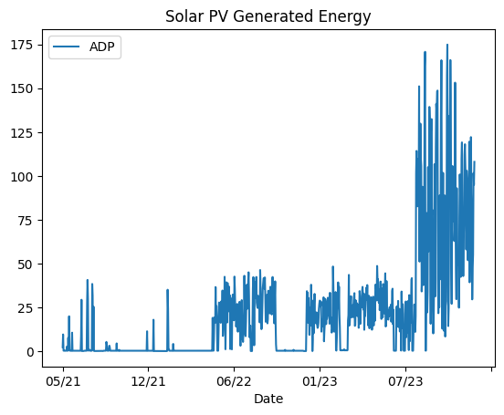
    


    
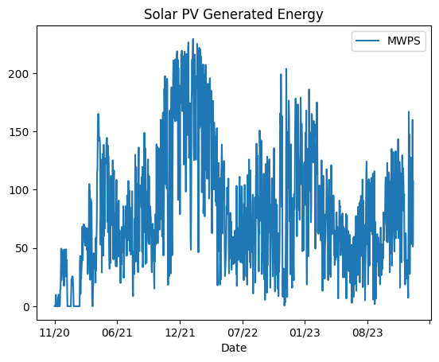
    


    
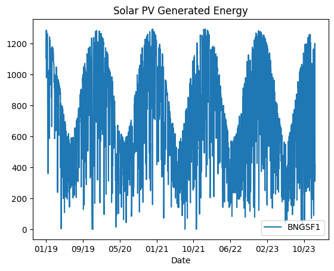
    


    
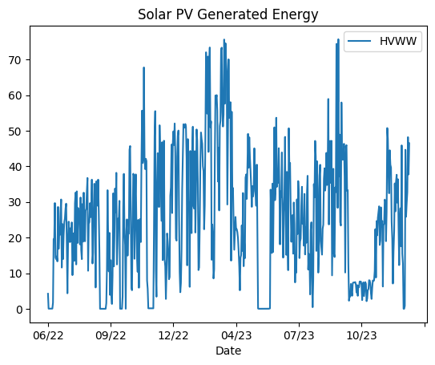
    


    
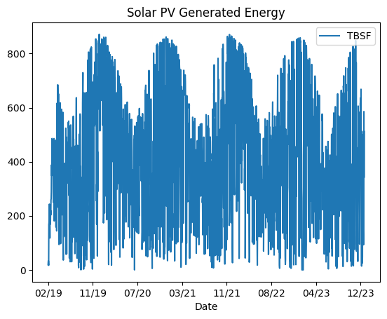
    


    
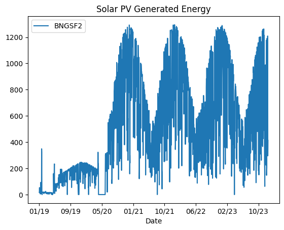
    


    
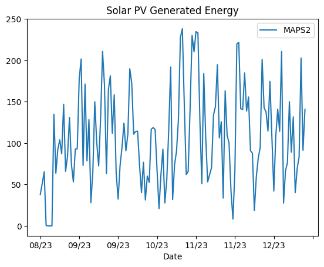
    


    
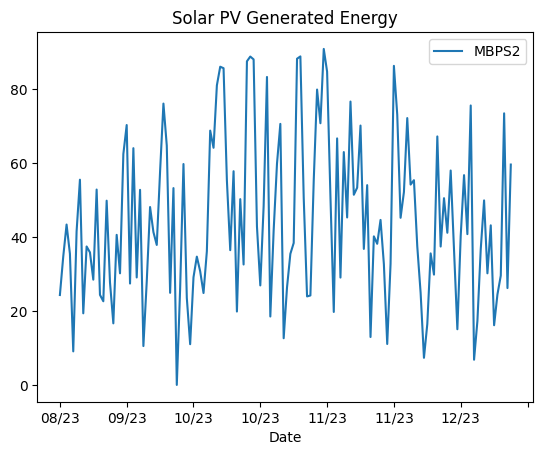
    


    
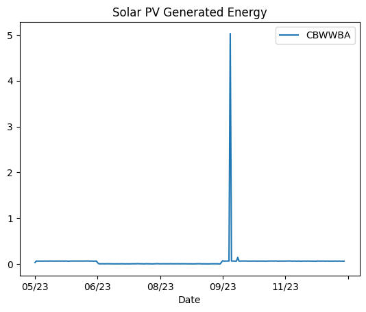
    


    
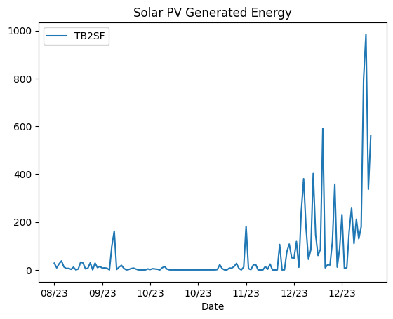
    


We can get several impressions:

* Some areas have very seasonal data such as `BNGSF1`, some have smaller number of data points such as `MAPS2`, `MBPS2`, `TB2SF`. The area code `CBWWBA` have extremely sparse data.

* Looking at the seasonal data being capped from above, it seems that the seasonal-trend decomposition would be multiplicative.

* Some secondary plants marked with `2` suffix might be related to their primary plant, so I am thinking of predicting both areas at once.

## Time Series Modeling

We will use several time series models such as:


1. Baseline models: naive model, seasonal-naive model (one year, i.e. 365.25 days extrapolated), naive with drift term, window average (7 days).

    These are simple enough to be implemented in-house and can be easily adjusted for missing values.


2. Statistical models: theta's method, exponential smoothing (ETS), autoregressive integrated moving average (ARIMA, max p, q = 5), Croston's method.

    Theta model is picked due to its high accuracy in various competition such as M5, while Croston is picked for being able to handle intermmitent series.

    We incorporate temperature and solar irradiance as exogenous factors into the ARIMA model.


3. Machine learning models: LightGBM for fast performance.

    The very well-known LSTM is not used here particularly because the well known libraries such as `TensorFlow` requires additional hardware requirement (i.e. graphic card) which not everyone will necessarily have by default, while using CPU will usually be too slow.


4. Ensemble model: simply averaging out with no regards to weighting.


We use RMSE and AIC as accuracy metrics for our model, and pick the best model for each solar plant location in South Australia.


```python
# === Model

from statsforecast import StatsForecast
from statsforecast.models import Naive, SeasonalNaive, RandomWalkWithDrift, WindowAverage, \
                                 AutoTheta, AutoETS, AutoARIMA, CrostonOptimized
from mlforecast import MLForecast
from lightgbm import LGBMRegressor

h = 3

# Change header for modelling library
sol_sf = sol[["Name", "Date", "Energy", "Temperature", "Solar Irradiance"]] \
                .replace("", np.nan).dropna() \
                .rename(columns = {
                    "Name": "unique_id",
                    "Date": "ds",
                    "Energy": "y"
                })

models = [Naive(), SeasonalNaive(365), RandomWalkWithDrift(), WindowAverage(7), \
          AutoTheta(), AutoETS(), AutoARIMA(), CrostonOptimized()]
sf = StatsForecast(models, freq="D", df=sol_sf)
```

    /home/rotisayabundar/.local/lib/python3.8/site-packages/statsforecast/core.py:25: TqdmExperimentalWarning: Using `tqdm.autonotebook.tqdm` in notebook mode. Use `tqdm.tqdm` instead to force console mode (e.g. in jupyter console)
      from tqdm.autonotebook import tqdm


```python
# === Cross-validation

# Based on short vs long time series
# For simplicity, load the objects from Pickle

ds_counts = sol_sf.groupby("unique_id").size()
ds_count_limit = 500
sol_sf_filter = sol_sf["unique_id"].isin(ds_counts[ds_counts > ds_count_limit].index)
sol_sf_long = sol_sf[sol_sf_filter]
sol_sf_short = sol_sf[-sol_sf_filter]
if not isfile("save_model.pkl"):
    # combined cv results
    cv_sol_sf_long = sf.cross_validation(df=sol_sf_long, h=h, n_windows=5, step_size = 100) \
                        .reset_index()
    cv_sol_sf_short = sf.cross_validation(df=sol_sf_short, h=h, n_windows=5, step_size = 10) \
                        .reset_index()
    cv_sol_sf = pd.concat([cv_sol_sf_long, cv_sol_sf_short])
    with open('save_model.pkl', 'wb') as outp:
        pickle.dump(cv_sol_sf, outp, pickle.HIGHEST_PROTOCOL)
else:
    with open('save_model.pkl', 'rb') as inp:
        cv_sol_sf = pickle.load(inp)

# Ensemble result
cv_sol_sf["h"] = (cv_sol_sf["ds"] - cv_sol_sf["cutoff"]).dt.days
cv_sol_sf["EnsembleBaseline"] = cv_sol_sf.loc[:, "Naive":"WindowAverage"].mean(axis=1)
cv_sol_sf["EnsembleAll"] = cv_sol_sf.loc[:, "Naive":"CrostonOptimized"].mean(axis=1)

print(cv_sol_sf)
```

       unique_id                  ds              cutoff           y     Naive  \
    0        ADP 2022-11-27 04:00:00 2022-11-26 04:00:00    0.192000    0.1920   
    1        ADP 2022-11-28 04:00:00 2022-11-26 04:00:00    0.192000    0.1920   
    2        ADP 2022-11-29 04:00:00 2022-11-26 04:00:00    0.192000    0.1920   
    3        ADP 2023-03-07 04:00:00 2023-03-06 04:00:00    0.448600    1.0057   
    4        ADP 2023-03-08 04:00:00 2023-03-06 04:00:00    0.419100    1.0057   
    ..       ...                 ...                 ...         ...       ...   
    55     TB2SF 2023-12-23 04:00:00 2023-12-21 04:00:00  231.399994   11.8000   
    56     TB2SF 2023-12-24 04:00:00 2023-12-21 04:00:00    6.667000   11.8000   
    57     TB2SF 2024-01-01 04:00:00 2023-12-31 04:00:00  796.099976  180.0000   
    58     TB2SF 2024-01-02 04:00:00 2023-12-31 04:00:00  984.700012  180.0000   
    59     TB2SF 2024-01-03 04:00:00 2023-12-31 04:00:00  336.500000  180.0000   
    
        SeasonalNaive         RWD  WindowAverage   AutoTheta     AutoETS  \
    0        0.202200    0.188337       0.192000    0.228800    0.192013   
    1        0.197200    0.184673       0.192000    0.244135    0.192013   
    2        0.202000    0.181010       0.192000    0.259469    0.192013   
    3        0.217367    1.003833       0.554807    0.781225    0.781886   
    4        0.215000    1.001965       0.554807    0.781225    0.781886   
    ..            ...         ...            ...         ...         ...   
    55            NaN   11.525593     161.539993  147.201889  139.731689   
    56            NaN   11.388390     161.539993  148.198517  139.731689   
    57            NaN  181.187576     151.880859  153.569366  146.689377   
    58            NaN  182.375153     151.880859  154.696732  146.689377   
    59            NaN  183.562729     151.880859  155.824112  146.689377   
    
         AutoARIMA  CrostonOptimized  h  EnsembleBaseline  EnsembleAll  
    0     0.165937          0.192244  1          0.193634     0.194191  
    1     0.154881          0.192244  2          0.191468     0.193643  
    2     0.148289          0.192244  3          0.191752     0.194878  
    3     3.420519          1.261855  1          0.695427     1.128399  
    4     4.408149          1.261855  2          0.694368     1.251323  
    ..         ...               ... ..               ...          ...  
    55  116.990318        131.076614  2         61.621861   102.838013  
    56  240.041000        131.076614  3         61.576126   120.539467  
    57  130.715790        143.156876  1        171.022812   155.314255  
    58  148.783264        143.156876  2        171.418655   158.226044  
    59  203.002975        143.156876  3        171.814529   166.302414  
    
    [180 rows x 15 columns]


```python
# === Accuracy

from utilsforecast.evaluation import evaluate
from utilsforecast.losses import mape, mse

def evaluate_cross_validation(df, metrics): #Simplify soon?
    models = df.drop(columns=['unique_id', 'ds', 'cutoff', 'y', 'h']).columns.tolist()
    evals = []
    for cutoff in df['cutoff'].unique():
        df_smp = df[df['cutoff'] == cutoff]
        for h in df_smp['h'].unique():
            df_smp_smp = df_smp[df_smp['h'] == h]
            eval_ = evaluate(df_smp_smp, metrics=metrics, models=models)
            eval_['h'] = h
            evals.append(eval_)
    evals = pd.concat(evals)
    evals = evals.groupby(["unique_id", "metric", "h"]).mean(numeric_only=True) # Averages the error metrics for all cutoffs for every combination of model and unique_id
    evals['best_model'] = evals.idxmin(axis=1)
    return evals.reset_index()

# AIC, BIC soon
error_sol_sf = evaluate_cross_validation(cv_sol_sf, [mape, mse]) # ignore SeasonalNaive when 0
print(error_sol_sf)
```

       unique_id metric  h          Naive  SeasonalNaive            RWD  \
    0        ADP   mape  1       0.397290       0.463344       0.400711   
    1        ADP   mape  2       1.899838       0.436166       1.909914   
    2        ADP   mape  3       0.412706       0.628034       0.423058   
    3        ADP    mse  1     386.909210     972.581055     389.384827   
    4        ADP    mse  2    3215.889404    1546.615479    3227.662598   
    ..       ...    ... ..            ...            ...            ...   
    67      TBSF   mape  2      11.385960       7.956800      11.399472   
    68      TBSF   mape  3      21.597364      14.788740      21.636360   
    69      TBSF    mse  1   27545.275391  128216.023438   27581.222656   
    70      TBSF    mse  2  241785.156250  116213.539062  242048.531250   
    71      TBSF    mse  3  146245.375000  110871.046875  146305.015625   
    
        WindowAverage     AutoTheta       AutoETS     AutoARIMA  CrostonOptimized  \
    0        0.171880      0.318728      0.278924      1.467186          0.474800   
    1        1.016733      1.553277      1.497192      2.973029          1.614609   
    2        0.280841      0.409627      0.338751      2.221922          0.566422   
    3       55.855366    102.463829    101.033600     56.350109         46.222507   
    4     1024.796631   1971.151367   1970.909424   1115.233032       1662.051758   
    ..            ...           ...           ...           ...               ...   
    67       6.702296      6.732865      6.654040      8.460343          6.730725   
    68      12.818724     12.701464     12.514979     11.300138         12.698760   
    69   42683.683594  47399.949219  46045.347656  20188.265625      47207.324219   
    70   80256.398438  84740.210938  84326.640625  93052.078125      84608.632812   
    71   42469.039062  36979.214844  37052.160156  61366.164062      37067.117188   
    
        EnsembleBaseline    EnsembleAll        best_model  
    0           0.156728       0.357167  EnsembleBaseline  
    1           1.184406       1.536746     SeasonalNaive  
    2           0.275014       0.567956  EnsembleBaseline  
    3          19.227848      19.977350  EnsembleBaseline  
    4        1719.837158    1653.875366     WindowAverage  
    ..               ...            ...               ...  
    67          9.235895       8.142327           AutoETS  
    68         17.587042      14.945439         AutoARIMA  
    69      18383.281250   25534.541016  EnsembleBaseline  
    70     131142.781250  101780.234375     WindowAverage  
    71      74843.171875   54249.914062         AutoTheta  
    
    [72 rows x 14 columns]


```python
# Collect final predictions: STILLSOMESSY

final = cv_sol_sf[cv_sol_sf["cutoff"] == max(cv_sol_sf["cutoff"].unique())]
final = final.merge(error_sol_sf[error_sol_sf['metric'] == "mse"][["unique_id", "h", "best_model"]], \
                    on=["unique_id", "h"], how="outer")
final = final.melt(id_vars = ["unique_id", "ds", "best_model"])
preds = final[final["best_model"] == final["variable"]] \
            .drop(columns="variable") \
            .sort_values(by = ["unique_id", "ds"]) \
            .rename(columns = {"value": "y"})
hists = sol_sf

print(preds)
```

        unique_id                  ds        best_model            y
    396       ADP 2024-01-01 04:00:00  EnsembleBaseline    46.327145
    181       ADP 2024-01-02 04:00:00     WindowAverage    67.991142
    218       ADP 2024-01-03 04:00:00         AutoTheta     63.91304
    183    BNGSF1 2024-01-01 04:00:00     WindowAverage   546.698547
    112    BNGSF1 2024-01-02 04:00:00     SeasonalNaive       1272.0
    293    BNGSF1 2024-01-03 04:00:00         AutoARIMA   147.196732
    186    BNGSF2 2024-01-01 04:00:00     WindowAverage   600.042847
    115    BNGSF2 2024-01-02 04:00:00     SeasonalNaive       1279.0
    296    BNGSF2 2024-01-03 04:00:00         AutoARIMA   245.830627
    441   BOLIVAR 2024-01-01 04:00:00       EnsembleAll    21.597504
    406   BOLIVAR 2024-01-02 04:00:00  EnsembleBaseline    21.094707
    335   BOLIVAR 2024-01-03 04:00:00  CrostonOptimized    20.383728
    348    CBWWBA 2024-01-01 04:00:00  CrostonOptimized     0.065247
    205    CBWWBA 2024-01-02 04:00:00     WindowAverage     0.065249
    206    CBWWBA 2024-01-03 04:00:00     WindowAverage     0.065249
    84       HVWW 2024-01-01 04:00:00             Naive    29.655001
    229      HVWW 2024-01-02 04:00:00         AutoTheta     27.30868
    230      HVWW 2024-01-03 04:00:00         AutoTheta     27.30868
    351     MAPS2 2024-01-01 04:00:00  CrostonOptimized    91.656982
    316     MAPS2 2024-01-02 04:00:00         AutoARIMA   130.748505
    317     MAPS2 2024-01-03 04:00:00         AutoARIMA    82.357224
    210     MBPS2 2024-01-01 04:00:00     WindowAverage    31.127142
    319     MBPS2 2024-01-02 04:00:00         AutoARIMA    57.230907
    320     MBPS2 2024-01-03 04:00:00         AutoARIMA    32.903252
    87       MWPS 2024-01-01 04:00:00             Naive    62.139999
    196      MWPS 2024-01-02 04:00:00     WindowAverage    93.983429
    305      MWPS 2024-01-03 04:00:00         AutoARIMA    18.828985
    306    PAREPW 2024-01-01 04:00:00         AutoARIMA   2152.16748
    235    PAREPW 2024-01-02 04:00:00         AutoTheta  2535.203125
    236    PAREPW 2024-01-03 04:00:00         AutoTheta  2536.700928
    249     TB2SF 2024-01-01 04:00:00         AutoTheta   153.569366
    250     TB2SF 2024-01-02 04:00:00         AutoTheta   154.696732
    359     TB2SF 2024-01-03 04:00:00  CrostonOptimized   143.156876
    417      TBSF 2024-01-01 04:00:00  EnsembleBaseline    330.01001
    202      TBSF 2024-01-02 04:00:00     WindowAverage   304.838562
    239      TBSF 2024-01-03 04:00:00         AutoTheta   294.409546


```python
# Try generating Optimal Ensemble

from scipy.optimize import minimize, Bounds

def regularised_sum_se(w, y, X, a):
    return np.linalg.norm(y - X @ w)**2 + a*np.linalg.norm(w)**2

curr_loc = "ADP"
curr_h = 1
y = cv_sol_sf.loc[(cv_sol_sf["unique_id"] == curr_loc) & (cv_sol_sf["h"] == curr_h), "y"]
X = cv_sol_sf.loc[(cv_sol_sf["unique_id"] == curr_loc) & (cv_sol_sf["h"] == curr_h), "Naive":"CrostonOptimized"]
w0 = np.array(8*[1]) / 8
a = 0.5
bound = Bounds(8 * [0], 8 * [1])
cons = {"type" : "eq", "fun": lambda w: np.sum(w) - 1}
        
res = minimize(lambda w: regularised_sum_se(w, y, X, a), w0, bounds=bound, constraints=cons, options={'disp': True})
res
```

    Optimization terminated successfully    (Exit mode 0)
                Current function value: 4.677687830451783
                Iterations: 8
                Function evaluations: 76
                Gradient evaluations: 8


     message: Optimization terminated successfully
     success: True
      status: 0
         fun: 4.677687830451783
           x: [ 5.011e-02  2.257e-01  2.613e-02  2.523e-15  1.532e-01
                2.514e-01  2.934e-01  0.000e+00]
         nit: 8
         jac: [ 1.616e+01  1.616e+01  1.616e+01  1.801e+01  1.617e+01
                1.617e+01  1.617e+01  1.935e+01]
        nfev: 76
        njev: 8


## Visualisation

Note that the prediction is currently for up to three days based on historical data, so in general forecasts for later days are less accurate than the early ones.

Accuracy rank: MWPS, BNGSF; ADP MAPS, MBPS, MWPS; etc; TB2SF


```python
# === Basic visualisation

import plotly.graph_objects as go
import plotly.io as pio
pio.renderers.default = "plotly_mimetype+notebook_connected"

def sol_points(unique_id):
    curr_hists = hists[hists["unique_id"] == unique_id]
    curr_preds = preds[preds["unique_id"] == unique_id]
    return(dict(x = [curr_hists["ds"][-60:-h], curr_hists["ds"][-(h+1):], pd.concat([curr_hists["ds"][-(h+1):-h], curr_preds["ds"]])],
                y = [curr_hists["y"][-60:-h], curr_hists["y"][-(h+1):], pd.concat([curr_hists["y"][-(h+1):-h], curr_preds["y"]])],
                visible = True))

curr_loc = "ADP"
curr_sol_points = sol_points(curr_loc)
fig = go.Figure()
fig.add_trace(go.Scatter(x = curr_sol_points["x"][0], y = curr_sol_points["y"][0], mode='lines', name = "Historic"))
fig.add_trace(go.Scatter(x = curr_sol_points["x"][1], y = curr_sol_points["y"][1], mode='lines', name = "Actual"))
fig.add_trace(go.Scatter(x = curr_sol_points["x"][2], y = curr_sol_points["y"][2], mode='lines', name = "Forecast"))
fig.update_layout(barmode = 'overlay', template = "plotly_white")
fig.update_layout(
    updatemenus = [dict(direction = "down",
                        buttons = [dict(args=[sol_points(loc)],
                                        label=loc,
                                        method="restyle") for loc in sol["Name"].unique()],
                        pad = {"r": 10, "t": 10}, showactive =True,
                        x = 0.11, xanchor="left", y = 1.1, yanchor = "top")]
)
fig
```


<script type="text/javascript">
window.PlotlyConfig = {MathJaxConfig: 'local'};
if (window.MathJax && window.MathJax.Hub && window.MathJax.Hub.Config) {window.MathJax.Hub.Config({SVG: {font: "STIX-Web"}});}
if (typeof require !== 'undefined') {
require.undef("plotly");
requirejs.config({
    paths: {
        'plotly': ['https://cdn.plot.ly/plotly-2.27.0.min']
    }
});
require(['plotly'], function(Plotly) {
    window._Plotly = Plotly;
});
}
</script>


<div>                            <div id="04e38161-c00c-439d-9a2d-ae1bde9c8508" class="plotly-graph-div" style="height:525px; width:100%;"></div>            <script type="text/javascript">                require(["plotly"], function(Plotly) {                    window.PLOTLYENV=window.PLOTLYENV || {};                                    if (document.getElementById("04e38161-c00c-439d-9a2d-ae1bde9c8508")) {                    Plotly.newPlot(                        "04e38161-c00c-439d-9a2d-ae1bde9c8508",                        [{"mode":"lines","name":"Historic","x":["2023-11-05 04:00:00","2023-11-06 04:00:00","2023-11-07 04:00:00","2023-11-08 04:00:00","2023-11-09 04:00:00","2023-11-10 04:00:00","2023-11-11 04:00:00","2023-11-12 04:00:00","2023-11-13 04:00:00","2023-11-14 04:00:00","2023-11-15 04:00:00","2023-11-16 04:00:00","2023-11-17 04:00:00","2023-11-18 04:00:00","2023-11-19 04:00:00","2023-11-20 04:00:00","2023-11-21 04:00:00","2023-11-22 04:00:00","2023-11-23 04:00:00","2023-11-24 04:00:00","2023-11-25 04:00:00","2023-11-26 04:00:00","2023-11-27 04:00:00","2023-11-28 04:00:00","2023-11-29 04:00:00","2023-11-30 04:00:00","2023-12-01 04:00:00","2023-12-02 04:00:00","2023-12-03 04:00:00","2023-12-04 04:00:00","2023-12-05 04:00:00","2023-12-06 04:00:00","2023-12-07 04:00:00","2023-12-08 04:00:00","2023-12-09 04:00:00","2023-12-10 04:00:00","2023-12-11 04:00:00","2023-12-12 04:00:00","2023-12-13 04:00:00","2023-12-14 04:00:00","2023-12-15 04:00:00","2023-12-16 04:00:00","2023-12-17 04:00:00","2023-12-18 04:00:00","2023-12-19 04:00:00","2023-12-20 04:00:00","2023-12-21 04:00:00","2023-12-22 04:00:00","2023-12-23 04:00:00","2023-12-24 04:00:00","2023-12-25 04:00:00","2023-12-26 04:00:00","2023-12-27 04:00:00","2023-12-28 04:00:00","2023-12-29 04:00:00","2023-12-30 04:00:00","2023-12-31 04:00:00"],"y":[24.1203,69.9555,134.3076,128.0066,166.1027,144.3015,51.459,26.98,101.9049,105.6046,102.2071,74.0632,89.39110000000001,62.8292,69.27579999999999,153.2092,74.2747,46.2452,29.6018,92.959467,57.3489,49.0292,54.1249,55.0554,24.771,76.24783330000001,100.8104,89.586,42.321,69.0632,109.5094,119.1086,65.798,74.52000000000001,42.83,62.971,76.939,112.05,118.05,105.709,96.72,57.965,102.96,98.58,58.61,51.834,81.428,57.85,119.49,39.256,56.863,53.087,122.13,89.834,76.89,29.504,47.63],"type":"scatter"},{"mode":"lines","name":"Actual","x":["2023-12-31 04:00:00","2024-01-01 04:00:00","2024-01-02 04:00:00","2024-01-03 04:00:00"],"y":[47.63,55.107,101.577,94.961],"type":"scatter"},{"mode":"lines","name":"Forecast","x":["2023-12-31 04:00:00","2024-01-01T04:00:00","2024-01-02T04:00:00","2024-01-03T04:00:00"],"y":[47.63,46.327144622802734,67.99114227294922,63.91304016113281],"type":"scatter"}],                        {"template":{"data":{"barpolar":[{"marker":{"line":{"color":"white","width":0.5},"pattern":{"fillmode":"overlay","size":10,"solidity":0.2}},"type":"barpolar"}],"bar":[{"error_x":{"color":"#2a3f5f"},"error_y":{"color":"#2a3f5f"},"marker":{"line":{"color":"white","width":0.5},"pattern":{"fillmode":"overlay","size":10,"solidity":0.2}},"type":"bar"}],"carpet":[{"aaxis":{"endlinecolor":"#2a3f5f","gridcolor":"#C8D4E3","linecolor":"#C8D4E3","minorgridcolor":"#C8D4E3","startlinecolor":"#2a3f5f"},"baxis":{"endlinecolor":"#2a3f5f","gridcolor":"#C8D4E3","linecolor":"#C8D4E3","minorgridcolor":"#C8D4E3","startlinecolor":"#2a3f5f"},"type":"carpet"}],"choropleth":[{"colorbar":{"outlinewidth":0,"ticks":""},"type":"choropleth"}],"contourcarpet":[{"colorbar":{"outlinewidth":0,"ticks":""},"type":"contourcarpet"}],"contour":[{"colorbar":{"outlinewidth":0,"ticks":""},"colorscale":[[0.0,"#0d0887"],[0.1111111111111111,"#46039f"],[0.2222222222222222,"#7201a8"],[0.3333333333333333,"#9c179e"],[0.4444444444444444,"#bd3786"],[0.5555555555555556,"#d8576b"],[0.6666666666666666,"#ed7953"],[0.7777777777777778,"#fb9f3a"],[0.8888888888888888,"#fdca26"],[1.0,"#f0f921"]],"type":"contour"}],"heatmapgl":[{"colorbar":{"outlinewidth":0,"ticks":""},"colorscale":[[0.0,"#0d0887"],[0.1111111111111111,"#46039f"],[0.2222222222222222,"#7201a8"],[0.3333333333333333,"#9c179e"],[0.4444444444444444,"#bd3786"],[0.5555555555555556,"#d8576b"],[0.6666666666666666,"#ed7953"],[0.7777777777777778,"#fb9f3a"],[0.8888888888888888,"#fdca26"],[1.0,"#f0f921"]],"type":"heatmapgl"}],"heatmap":[{"colorbar":{"outlinewidth":0,"ticks":""},"colorscale":[[0.0,"#0d0887"],[0.1111111111111111,"#46039f"],[0.2222222222222222,"#7201a8"],[0.3333333333333333,"#9c179e"],[0.4444444444444444,"#bd3786"],[0.5555555555555556,"#d8576b"],[0.6666666666666666,"#ed7953"],[0.7777777777777778,"#fb9f3a"],[0.8888888888888888,"#fdca26"],[1.0,"#f0f921"]],"type":"heatmap"}],"histogram2dcontour":[{"colorbar":{"outlinewidth":0,"ticks":""},"colorscale":[[0.0,"#0d0887"],[0.1111111111111111,"#46039f"],[0.2222222222222222,"#7201a8"],[0.3333333333333333,"#9c179e"],[0.4444444444444444,"#bd3786"],[0.5555555555555556,"#d8576b"],[0.6666666666666666,"#ed7953"],[0.7777777777777778,"#fb9f3a"],[0.8888888888888888,"#fdca26"],[1.0,"#f0f921"]],"type":"histogram2dcontour"}],"histogram2d":[{"colorbar":{"outlinewidth":0,"ticks":""},"colorscale":[[0.0,"#0d0887"],[0.1111111111111111,"#46039f"],[0.2222222222222222,"#7201a8"],[0.3333333333333333,"#9c179e"],[0.4444444444444444,"#bd3786"],[0.5555555555555556,"#d8576b"],[0.6666666666666666,"#ed7953"],[0.7777777777777778,"#fb9f3a"],[0.8888888888888888,"#fdca26"],[1.0,"#f0f921"]],"type":"histogram2d"}],"histogram":[{"marker":{"pattern":{"fillmode":"overlay","size":10,"solidity":0.2}},"type":"histogram"}],"mesh3d":[{"colorbar":{"outlinewidth":0,"ticks":""},"type":"mesh3d"}],"parcoords":[{"line":{"colorbar":{"outlinewidth":0,"ticks":""}},"type":"parcoords"}],"pie":[{"automargin":true,"type":"pie"}],"scatter3d":[{"line":{"colorbar":{"outlinewidth":0,"ticks":""}},"marker":{"colorbar":{"outlinewidth":0,"ticks":""}},"type":"scatter3d"}],"scattercarpet":[{"marker":{"colorbar":{"outlinewidth":0,"ticks":""}},"type":"scattercarpet"}],"scattergeo":[{"marker":{"colorbar":{"outlinewidth":0,"ticks":""}},"type":"scattergeo"}],"scattergl":[{"marker":{"colorbar":{"outlinewidth":0,"ticks":""}},"type":"scattergl"}],"scattermapbox":[{"marker":{"colorbar":{"outlinewidth":0,"ticks":""}},"type":"scattermapbox"}],"scatterpolargl":[{"marker":{"colorbar":{"outlinewidth":0,"ticks":""}},"type":"scatterpolargl"}],"scatterpolar":[{"marker":{"colorbar":{"outlinewidth":0,"ticks":""}},"type":"scatterpolar"}],"scatter":[{"fillpattern":{"fillmode":"overlay","size":10,"solidity":0.2},"type":"scatter"}],"scatterternary":[{"marker":{"colorbar":{"outlinewidth":0,"ticks":""}},"type":"scatterternary"}],"surface":[{"colorbar":{"outlinewidth":0,"ticks":""},"colorscale":[[0.0,"#0d0887"],[0.1111111111111111,"#46039f"],[0.2222222222222222,"#7201a8"],[0.3333333333333333,"#9c179e"],[0.4444444444444444,"#bd3786"],[0.5555555555555556,"#d8576b"],[0.6666666666666666,"#ed7953"],[0.7777777777777778,"#fb9f3a"],[0.8888888888888888,"#fdca26"],[1.0,"#f0f921"]],"type":"surface"}],"table":[{"cells":{"fill":{"color":"#EBF0F8"},"line":{"color":"white"}},"header":{"fill":{"color":"#C8D4E3"},"line":{"color":"white"}},"type":"table"}]},"layout":{"annotationdefaults":{"arrowcolor":"#2a3f5f","arrowhead":0,"arrowwidth":1},"autotypenumbers":"strict","coloraxis":{"colorbar":{"outlinewidth":0,"ticks":""}},"colorscale":{"diverging":[[0,"#8e0152"],[0.1,"#c51b7d"],[0.2,"#de77ae"],[0.3,"#f1b6da"],[0.4,"#fde0ef"],[0.5,"#f7f7f7"],[0.6,"#e6f5d0"],[0.7,"#b8e186"],[0.8,"#7fbc41"],[0.9,"#4d9221"],[1,"#276419"]],"sequential":[[0.0,"#0d0887"],[0.1111111111111111,"#46039f"],[0.2222222222222222,"#7201a8"],[0.3333333333333333,"#9c179e"],[0.4444444444444444,"#bd3786"],[0.5555555555555556,"#d8576b"],[0.6666666666666666,"#ed7953"],[0.7777777777777778,"#fb9f3a"],[0.8888888888888888,"#fdca26"],[1.0,"#f0f921"]],"sequentialminus":[[0.0,"#0d0887"],[0.1111111111111111,"#46039f"],[0.2222222222222222,"#7201a8"],[0.3333333333333333,"#9c179e"],[0.4444444444444444,"#bd3786"],[0.5555555555555556,"#d8576b"],[0.6666666666666666,"#ed7953"],[0.7777777777777778,"#fb9f3a"],[0.8888888888888888,"#fdca26"],[1.0,"#f0f921"]]},"colorway":["#636efa","#EF553B","#00cc96","#ab63fa","#FFA15A","#19d3f3","#FF6692","#B6E880","#FF97FF","#FECB52"],"font":{"color":"#2a3f5f"},"geo":{"bgcolor":"white","lakecolor":"white","landcolor":"white","showlakes":true,"showland":true,"subunitcolor":"#C8D4E3"},"hoverlabel":{"align":"left"},"hovermode":"closest","mapbox":{"style":"light"},"paper_bgcolor":"white","plot_bgcolor":"white","polar":{"angularaxis":{"gridcolor":"#EBF0F8","linecolor":"#EBF0F8","ticks":""},"bgcolor":"white","radialaxis":{"gridcolor":"#EBF0F8","linecolor":"#EBF0F8","ticks":""}},"scene":{"xaxis":{"backgroundcolor":"white","gridcolor":"#DFE8F3","gridwidth":2,"linecolor":"#EBF0F8","showbackground":true,"ticks":"","zerolinecolor":"#EBF0F8"},"yaxis":{"backgroundcolor":"white","gridcolor":"#DFE8F3","gridwidth":2,"linecolor":"#EBF0F8","showbackground":true,"ticks":"","zerolinecolor":"#EBF0F8"},"zaxis":{"backgroundcolor":"white","gridcolor":"#DFE8F3","gridwidth":2,"linecolor":"#EBF0F8","showbackground":true,"ticks":"","zerolinecolor":"#EBF0F8"}},"shapedefaults":{"line":{"color":"#2a3f5f"}},"ternary":{"aaxis":{"gridcolor":"#DFE8F3","linecolor":"#A2B1C6","ticks":""},"baxis":{"gridcolor":"#DFE8F3","linecolor":"#A2B1C6","ticks":""},"bgcolor":"white","caxis":{"gridcolor":"#DFE8F3","linecolor":"#A2B1C6","ticks":""}},"title":{"x":0.05},"xaxis":{"automargin":true,"gridcolor":"#EBF0F8","linecolor":"#EBF0F8","ticks":"","title":{"standoff":15},"zerolinecolor":"#EBF0F8","zerolinewidth":2},"yaxis":{"automargin":true,"gridcolor":"#EBF0F8","linecolor":"#EBF0F8","ticks":"","title":{"standoff":15},"zerolinecolor":"#EBF0F8","zerolinewidth":2}}},"barmode":"overlay","updatemenus":[{"buttons":[{"args":[{"x":[["2023-11-05 04:00:00","2023-11-06 04:00:00","2023-11-07 04:00:00","2023-11-08 04:00:00","2023-11-09 04:00:00","2023-11-10 04:00:00","2023-11-11 04:00:00","2023-11-12 04:00:00","2023-11-13 04:00:00","2023-11-14 04:00:00","2023-11-15 04:00:00","2023-11-16 04:00:00","2023-11-17 04:00:00","2023-11-18 04:00:00","2023-11-19 04:00:00","2023-11-20 04:00:00","2023-11-21 04:00:00","2023-11-22 04:00:00","2023-11-23 04:00:00","2023-11-24 04:00:00","2023-11-25 04:00:00","2023-11-26 04:00:00","2023-11-27 04:00:00","2023-11-28 04:00:00","2023-11-29 04:00:00","2023-11-30 04:00:00","2023-12-01 04:00:00","2023-12-02 04:00:00","2023-12-03 04:00:00","2023-12-04 04:00:00","2023-12-05 04:00:00","2023-12-06 04:00:00","2023-12-07 04:00:00","2023-12-08 04:00:00","2023-12-09 04:00:00","2023-12-10 04:00:00","2023-12-11 04:00:00","2023-12-12 04:00:00","2023-12-13 04:00:00","2023-12-14 04:00:00","2023-12-15 04:00:00","2023-12-16 04:00:00","2023-12-17 04:00:00","2023-12-18 04:00:00","2023-12-19 04:00:00","2023-12-20 04:00:00","2023-12-21 04:00:00","2023-12-22 04:00:00","2023-12-23 04:00:00","2023-12-24 04:00:00","2023-12-25 04:00:00","2023-12-26 04:00:00","2023-12-27 04:00:00","2023-12-28 04:00:00","2023-12-29 04:00:00","2023-12-30 04:00:00","2023-12-31 04:00:00"],["2023-12-31 04:00:00","2024-01-01 04:00:00","2024-01-02 04:00:00","2024-01-03 04:00:00"],["2023-12-31 04:00:00","2024-01-01T04:00:00","2024-01-02T04:00:00","2024-01-03T04:00:00"]],"y":[[1218.8,1977.0,3279.8,2514.1,1712.4,3493.6,3855.5,3707.1,467.8,0.0,0.0,0.0091663,1026.7,854.4,2383.0,3496.0,3980.4,3462.3,2723.8,2416.6,2951.4,2720.9,2793.5,4121.4,2767.4,2292.9,2846.4,3051.8,783.9,1738.8,2026.4,2617.5,2912.0,2166.9,2915.6,1430.0,826.3000000000001,1480.1999999999998,2725.2,1994.9,2011.7,2346.4,1119.1,2670.6,3266.3,3339.8,2642.9,2374.3,2070.9,2901.9,3516.7,3728.6,1303.4,1379.3000000000002,2994.9,3478.9,1985.9],[1985.9,1384.8,2091.6,3113.1],[1985.9,2152.16748046875,2535.203125,2536.700927734375]],"visible":true}],"label":"PAREPW","method":"restyle"},{"args":[{"x":[["2023-11-05 04:00:00","2023-11-06 04:00:00","2023-11-07 04:00:00","2023-11-08 04:00:00","2023-11-09 04:00:00","2023-11-10 04:00:00","2023-11-11 04:00:00","2023-11-12 04:00:00","2023-11-13 04:00:00","2023-11-14 04:00:00","2023-11-15 04:00:00","2023-11-16 04:00:00","2023-11-17 04:00:00","2023-11-18 04:00:00","2023-11-19 04:00:00","2023-11-20 04:00:00","2023-11-21 04:00:00","2023-11-22 04:00:00","2023-11-23 04:00:00","2023-11-24 04:00:00","2023-11-25 04:00:00","2023-11-26 04:00:00","2023-11-27 04:00:00","2023-11-28 04:00:00","2023-11-29 04:00:00","2023-11-30 04:00:00","2023-12-01 04:00:00","2023-12-02 04:00:00","2023-12-03 04:00:00","2023-12-04 04:00:00","2023-12-05 04:00:00","2023-12-06 04:00:00","2023-12-07 04:00:00","2023-12-08 04:00:00","2023-12-09 04:00:00","2023-12-10 04:00:00","2023-12-11 04:00:00","2023-12-12 04:00:00","2023-12-13 04:00:00","2023-12-14 04:00:00","2023-12-15 04:00:00","2023-12-16 04:00:00","2023-12-17 04:00:00","2023-12-18 04:00:00","2023-12-19 04:00:00","2023-12-20 04:00:00","2023-12-21 04:00:00","2023-12-22 04:00:00","2023-12-23 04:00:00","2023-12-24 04:00:00","2023-12-25 04:00:00","2023-12-26 04:00:00","2023-12-27 04:00:00","2023-12-28 04:00:00","2023-12-29 04:00:00","2023-12-30 04:00:00","2023-12-31 04:00:00"],["2023-12-31 04:00:00","2024-01-01 04:00:00","2024-01-02 04:00:00","2024-01-03 04:00:00"],["2023-12-31 04:00:00","2024-01-01T04:00:00","2024-01-02T04:00:00","2024-01-03T04:00:00"]],"y":[[12.84983,32.94033,54.35008,51.12817,56.91746,52.35729,29.32717,12.110499999999998,45.02767,42.09833,44.43821,38.32813,44.81771,27.64646,31.59717,57.56783,33.81867,28.0875,10.09804,43.27779,26.16783,33.16921,23.97712,24.0805,0.153007,0.00775,22.047547,47.54679,28.70154,38.49692,37.49833,43.44796,27.24858,20.95625,11.28946,16.0395,22.27658,40.9655,30.29783,40.06871,32.74696,24.00783,34.5365,33.61692,11.55829,18.61658,30.65625,21.91854,44.23696,6.49925,23.39883,33.28667,45.2395,32.35783,24.58883,11.53783,11.11867],[11.11867,18.01688,42.56646,30.60933],[11.11867,21.597503662109375,21.094707489013672,20.38372802734375]],"visible":true}],"label":"BOLIVAR","method":"restyle"},{"args":[{"x":[["2023-11-05 04:00:00","2023-11-06 04:00:00","2023-11-07 04:00:00","2023-11-08 04:00:00","2023-11-09 04:00:00","2023-11-10 04:00:00","2023-11-11 04:00:00","2023-11-12 04:00:00","2023-11-13 04:00:00","2023-11-14 04:00:00","2023-11-15 04:00:00","2023-11-16 04:00:00","2023-11-17 04:00:00","2023-11-18 04:00:00","2023-11-19 04:00:00","2023-11-20 04:00:00","2023-11-21 04:00:00","2023-11-22 04:00:00","2023-11-23 04:00:00","2023-11-24 04:00:00","2023-11-25 04:00:00","2023-11-26 04:00:00","2023-11-27 04:00:00","2023-11-28 04:00:00","2023-11-29 04:00:00","2023-11-30 04:00:00","2023-12-01 04:00:00","2023-12-02 04:00:00","2023-12-03 04:00:00","2023-12-04 04:00:00","2023-12-05 04:00:00","2023-12-06 04:00:00","2023-12-07 04:00:00","2023-12-08 04:00:00","2023-12-09 04:00:00","2023-12-10 04:00:00","2023-12-11 04:00:00","2023-12-12 04:00:00","2023-12-13 04:00:00","2023-12-14 04:00:00","2023-12-15 04:00:00","2023-12-16 04:00:00","2023-12-17 04:00:00","2023-12-18 04:00:00","2023-12-19 04:00:00","2023-12-20 04:00:00","2023-12-21 04:00:00","2023-12-22 04:00:00","2023-12-23 04:00:00","2023-12-24 04:00:00","2023-12-25 04:00:00","2023-12-26 04:00:00","2023-12-27 04:00:00","2023-12-28 04:00:00","2023-12-29 04:00:00","2023-12-30 04:00:00","2023-12-31 04:00:00"],["2023-12-31 04:00:00","2024-01-01 04:00:00","2024-01-02 04:00:00","2024-01-03 04:00:00"],["2023-12-31 04:00:00","2024-01-01T04:00:00","2024-01-02T04:00:00","2024-01-03T04:00:00"]],"y":[[24.1203,69.9555,134.3076,128.0066,166.1027,144.3015,51.459,26.98,101.9049,105.6046,102.2071,74.0632,89.39110000000001,62.8292,69.27579999999999,153.2092,74.2747,46.2452,29.6018,92.959467,57.3489,49.0292,54.1249,55.0554,24.771,76.24783330000001,100.8104,89.586,42.321,69.0632,109.5094,119.1086,65.798,74.52000000000001,42.83,62.971,76.939,112.05,118.05,105.709,96.72,57.965,102.96,98.58,58.61,51.834,81.428,57.85,119.49,39.256,56.863,53.087,122.13,89.834,76.89,29.504,47.63],[47.63,55.107,101.577,94.961],[47.63,46.327144622802734,67.99114227294922,63.91304016113281]],"visible":true}],"label":"ADP","method":"restyle"},{"args":[{"x":[["2023-11-05 04:00:00","2023-11-06 04:00:00","2023-11-07 04:00:00","2023-11-08 04:00:00","2023-11-09 04:00:00","2023-11-10 04:00:00","2023-11-11 04:00:00","2023-11-12 04:00:00","2023-11-13 04:00:00","2023-11-14 04:00:00","2023-11-15 04:00:00","2023-11-16 04:00:00","2023-11-17 04:00:00","2023-11-18 04:00:00","2023-11-19 04:00:00","2023-11-20 04:00:00","2023-11-21 04:00:00","2023-11-22 04:00:00","2023-11-23 04:00:00","2023-11-24 04:00:00","2023-11-25 04:00:00","2023-11-26 04:00:00","2023-11-27 04:00:00","2023-11-28 04:00:00","2023-11-29 04:00:00","2023-11-30 04:00:00","2023-12-01 04:00:00","2023-12-02 04:00:00","2023-12-03 04:00:00","2023-12-04 04:00:00","2023-12-05 04:00:00","2023-12-06 04:00:00","2023-12-07 04:00:00","2023-12-08 04:00:00","2023-12-09 04:00:00","2023-12-10 04:00:00","2023-12-11 04:00:00","2023-12-12 04:00:00","2023-12-13 04:00:00","2023-12-14 04:00:00","2023-12-15 04:00:00","2023-12-16 04:00:00","2023-12-17 04:00:00","2023-12-18 04:00:00","2023-12-19 04:00:00","2023-12-20 04:00:00","2023-12-21 04:00:00","2023-12-22 04:00:00","2023-12-23 04:00:00","2023-12-24 04:00:00","2023-12-25 04:00:00","2023-12-26 04:00:00","2023-12-27 04:00:00","2023-12-28 04:00:00","2023-12-29 04:00:00","2023-12-30 04:00:00","2023-12-31 04:00:00"],["2023-12-31 04:00:00","2024-01-01 04:00:00","2024-01-02 04:00:00","2024-01-03 04:00:00"],["2023-12-31 04:00:00","2024-01-01T04:00:00","2024-01-02T04:00:00","2024-01-03T04:00:00"]],"y":[[46.9,90.14,113.4,108.17,133.04999999999998,58.4,115.06,65.25,115.65,101.95,117.02,114.29,143.37,58.49,97.0,92.18,123.89,115.56,15.965,114.45,110.72,86.49000000000001,96.63,37.71,89.97999999999999,129.60000000000002,97.32,84.73,118.42000000000002,105.08,81.66000000000001,96.15,39.007,38.357,18.699,23.299000000000003,62.603,41.1008,23.66,30.88,38.62,37.72,39.63,20.1,7.18,66.66,166.99,87.75999999999999,147.36,27.728,82.197,106.21,127.63,120.09,106.34,53.277,62.14],[62.14,59.91,159.9,51.285],[62.14,62.13999938964844,93.98342895507812,18.8289852142334]],"visible":true}],"label":"MWPS","method":"restyle"},{"args":[{"x":[["2023-11-05 04:00:00","2023-11-06 04:00:00","2023-11-07 04:00:00","2023-11-08 04:00:00","2023-11-09 04:00:00","2023-11-10 04:00:00","2023-11-11 04:00:00","2023-11-12 04:00:00","2023-11-13 04:00:00","2023-11-14 04:00:00","2023-11-15 04:00:00","2023-11-16 04:00:00","2023-11-17 04:00:00","2023-11-18 04:00:00","2023-11-19 04:00:00","2023-11-20 04:00:00","2023-11-21 04:00:00","2023-11-22 04:00:00","2023-11-23 04:00:00","2023-11-24 04:00:00","2023-11-25 04:00:00","2023-11-26 04:00:00","2023-11-27 04:00:00","2023-11-28 04:00:00","2023-11-29 04:00:00","2023-11-30 04:00:00","2023-12-01 04:00:00","2023-12-02 04:00:00","2023-12-03 04:00:00","2023-12-04 04:00:00","2023-12-05 04:00:00","2023-12-06 04:00:00","2023-12-07 04:00:00","2023-12-08 04:00:00","2023-12-09 04:00:00","2023-12-10 04:00:00","2023-12-11 04:00:00","2023-12-12 04:00:00","2023-12-13 04:00:00","2023-12-14 04:00:00","2023-12-15 04:00:00","2023-12-16 04:00:00","2023-12-17 04:00:00","2023-12-18 04:00:00","2023-12-19 04:00:00","2023-12-20 04:00:00","2023-12-21 04:00:00","2023-12-22 04:00:00","2023-12-23 04:00:00","2023-12-24 04:00:00","2023-12-25 04:00:00","2023-12-26 04:00:00","2023-12-27 04:00:00","2023-12-28 04:00:00","2023-12-29 04:00:00","2023-12-30 04:00:00","2023-12-31 04:00:00"],["2023-12-31 04:00:00","2024-01-01 04:00:00","2024-01-02 04:00:00","2024-01-03 04:00:00"],["2023-12-31 04:00:00","2024-01-01T04:00:00","2024-01-02T04:00:00","2024-01-03T04:00:00"]],"y":[[244.6,1032.0,1197.0,442.5,623.9,780.8,266.1,413.3,887.2,978.4,862.6,579.1,1238.0,272.5,408.7,885.2,757.4,271.2,366.7,1224.0,1255.0,1256.0,247.3,714.8,325.9,923.8,688.8,1257.0,625.3,1204.0,874.3,839.0,527.5,232.0,202.5,70.45,640.8,1071.0,935.9,971.4,604.3,367.3,564.6,331.5,191.7,202.1,532.2,1159.0,622.2,176.6,110.1,88.69,1163.0,1105.0,426.8,556.6,376.7],[376.7,389.7,1200.0,309.8],[376.7,546.6985473632812,1272.0,147.1967315673828]],"visible":true}],"label":"BNGSF1","method":"restyle"},{"args":[{"x":[["2023-11-05 04:00:00","2023-11-06 04:00:00","2023-11-07 04:00:00","2023-11-08 04:00:00","2023-11-09 04:00:00","2023-11-10 04:00:00","2023-11-11 04:00:00","2023-11-12 04:00:00","2023-11-13 04:00:00","2023-11-14 04:00:00","2023-11-15 04:00:00","2023-11-16 04:00:00","2023-11-17 04:00:00","2023-11-18 04:00:00","2023-11-19 04:00:00","2023-11-20 04:00:00","2023-11-21 04:00:00","2023-11-22 04:00:00","2023-11-23 04:00:00","2023-11-24 04:00:00","2023-11-25 04:00:00","2023-11-26 04:00:00","2023-11-27 04:00:00","2023-11-28 04:00:00","2023-11-29 04:00:00","2023-11-30 04:00:00","2023-12-01 04:00:00","2023-12-02 04:00:00","2023-12-03 04:00:00","2023-12-04 04:00:00","2023-12-05 04:00:00","2023-12-06 04:00:00","2023-12-07 04:00:00","2023-12-08 04:00:00","2023-12-09 04:00:00","2023-12-10 04:00:00","2023-12-11 04:00:00","2023-12-12 04:00:00","2023-12-13 04:00:00","2023-12-14 04:00:00","2023-12-15 04:00:00","2023-12-16 04:00:00","2023-12-17 04:00:00","2023-12-18 04:00:00","2023-12-19 04:00:00","2023-12-20 04:00:00","2023-12-21 04:00:00","2023-12-22 04:00:00","2023-12-23 04:00:00","2023-12-24 04:00:00","2023-12-25 04:00:00","2023-12-26 04:00:00","2023-12-27 04:00:00","2023-12-28 04:00:00","2023-12-29 04:00:00","2023-12-30 04:00:00","2023-12-31 04:00:00"],["2023-12-31 04:00:00","2024-01-01 04:00:00","2024-01-02 04:00:00","2024-01-03 04:00:00"],["2023-12-31 04:00:00","2024-01-01T04:00:00","2024-01-02T04:00:00","2024-01-03T04:00:00"]],"y":[[2.7632,5.821,7.960599999999999,7.7866,8.0022,10.5837,22.3734,8.78,24.6258,20.6262,25.5353,27.1085,28.775,17.927699999999998,19.142100000000003,28.477,23.0946,24.6608,6.2594,23.4329,23.908,30.6674,30.2147,18.9735,27.1262,50.7558,47.657,37.5629,32.425,44.5086,40.4408,39.6718,24.46,19.5486,7.089099999999999,16.0979,21.7908,35.2056,27.3697,35.71960000000001,37.6414,29.7706,36.3692,23.1903,12.270499999999998,25.182,28.226,17.5368,45.893,15.497999999999998,12.6438,0.006916,0.0075829999999999,0.8367,44.656,25.855,29.655],[29.655,32.729,48.2002,37.731],[29.655,29.655000686645508,27.308679580688477,27.308679580688477]],"visible":true}],"label":"HVWW","method":"restyle"},{"args":[{"x":[["2023-11-05 04:00:00","2023-11-06 04:00:00","2023-11-07 04:00:00","2023-11-08 04:00:00","2023-11-09 04:00:00","2023-11-10 04:00:00","2023-11-11 04:00:00","2023-11-12 04:00:00","2023-11-13 04:00:00","2023-11-14 04:00:00","2023-11-15 04:00:00","2023-11-16 04:00:00","2023-11-17 04:00:00","2023-11-18 04:00:00","2023-11-19 04:00:00","2023-11-20 04:00:00","2023-11-21 04:00:00","2023-11-22 04:00:00","2023-11-23 04:00:00","2023-11-24 04:00:00","2023-11-25 04:00:00","2023-11-26 04:00:00","2023-11-27 04:00:00","2023-11-28 04:00:00","2023-11-29 04:00:00","2023-11-30 04:00:00","2023-12-01 04:00:00","2023-12-02 04:00:00","2023-12-03 04:00:00","2023-12-04 04:00:00","2023-12-05 04:00:00","2023-12-06 04:00:00","2023-12-07 04:00:00","2023-12-08 04:00:00","2023-12-09 04:00:00","2023-12-10 04:00:00","2023-12-11 04:00:00","2023-12-12 04:00:00","2023-12-13 04:00:00","2023-12-14 04:00:00","2023-12-15 04:00:00","2023-12-16 04:00:00","2023-12-17 04:00:00","2023-12-18 04:00:00","2023-12-19 04:00:00","2023-12-20 04:00:00","2023-12-21 04:00:00","2023-12-22 04:00:00","2023-12-23 04:00:00","2023-12-24 04:00:00","2023-12-25 04:00:00","2023-12-26 04:00:00","2023-12-27 04:00:00","2023-12-28 04:00:00","2023-12-29 04:00:00","2023-12-30 04:00:00","2023-12-31 04:00:00"],["2023-12-31 04:00:00","2024-01-01 04:00:00","2024-01-02 04:00:00","2024-01-03 04:00:00"],["2023-12-31 04:00:00","2024-01-01T04:00:00","2024-01-02T04:00:00","2024-01-03T04:00:00"]],"y":[[74.73,393.7,653.7,760.2,816.1,638.6,76.25,98.15,292.4,269.0,375.9,267.0,848.0,375.5,345.7,766.7,406.4,68.94,153.0,451.3,282.5,324.3,233.4,122.3,31.57,274.6,605.8,490.0,316.0,390.3,571.6,570.3,420.6,246.4,95.47,297.0,584.1,386.4,617.5,413.5,636.2,515.0,668.0,341.7,28.52,14.18,23.37,512.0,133.9,25.01,47.59,499.6,445.1,438.1,465.2,145.4,92.88],[92.88,302.2,585.6,341.0],[92.88,330.010009765625,304.83856201171875,294.4095458984375]],"visible":true}],"label":"TBSF","method":"restyle"},{"args":[{"x":[["2023-11-05 04:00:00","2023-11-06 04:00:00","2023-11-07 04:00:00","2023-11-08 04:00:00","2023-11-09 04:00:00","2023-11-10 04:00:00","2023-11-11 04:00:00","2023-11-12 04:00:00","2023-11-13 04:00:00","2023-11-14 04:00:00","2023-11-15 04:00:00","2023-11-16 04:00:00","2023-11-17 04:00:00","2023-11-18 04:00:00","2023-11-19 04:00:00","2023-11-20 04:00:00","2023-11-21 04:00:00","2023-11-22 04:00:00","2023-11-23 04:00:00","2023-11-24 04:00:00","2023-11-25 04:00:00","2023-11-26 04:00:00","2023-11-27 04:00:00","2023-11-28 04:00:00","2023-11-29 04:00:00","2023-11-30 04:00:00","2023-12-01 04:00:00","2023-12-02 04:00:00","2023-12-03 04:00:00","2023-12-04 04:00:00","2023-12-05 04:00:00","2023-12-06 04:00:00","2023-12-07 04:00:00","2023-12-08 04:00:00","2023-12-09 04:00:00","2023-12-10 04:00:00","2023-12-11 04:00:00","2023-12-12 04:00:00","2023-12-13 04:00:00","2023-12-14 04:00:00","2023-12-15 04:00:00","2023-12-16 04:00:00","2023-12-17 04:00:00","2023-12-18 04:00:00","2023-12-19 04:00:00","2023-12-20 04:00:00","2023-12-21 04:00:00","2023-12-22 04:00:00","2023-12-23 04:00:00","2023-12-24 04:00:00","2023-12-25 04:00:00","2023-12-26 04:00:00","2023-12-27 04:00:00","2023-12-28 04:00:00","2023-12-29 04:00:00","2023-12-30 04:00:00","2023-12-31 04:00:00"],["2023-12-31 04:00:00","2024-01-01 04:00:00","2024-01-02 04:00:00","2024-01-03 04:00:00"],["2023-12-31 04:00:00","2024-01-01T04:00:00","2024-01-02T04:00:00","2024-01-03T04:00:00"]],"y":[[309.8,1051.0,1202.0,733.0,1168.0,898.2,365.1,261.7,933.3,1022.0,890.1,609.2,1098.0,376.5,420.0,903.1,1249.0,588.6,366.5,1225.0,1260.0,1257.0,426.7,723.0,868.1,940.6,1101.0,1263.0,488.9,1215.0,876.0,849.1,537.0,244.4,195.6,62.4,659.8,768.3,932.4,975.8,988.9,694.8,380.5,315.1,243.2,225.2,708.6,1176.0,793.1,147.2,178.7,204.5,1190.0,1089.0,539.9,615.5,382.7],[382.7,405.3,1209.0,295.3],[382.7,600.0428466796875,1279.0,245.83062744140625]],"visible":true}],"label":"BNGSF2","method":"restyle"},{"args":[{"x":[["2023-11-05 04:00:00","2023-11-06 04:00:00","2023-11-07 04:00:00","2023-11-08 04:00:00","2023-11-09 04:00:00","2023-11-10 04:00:00","2023-11-11 04:00:00","2023-11-12 04:00:00","2023-11-13 04:00:00","2023-11-14 04:00:00","2023-11-15 04:00:00","2023-11-16 04:00:00","2023-11-17 04:00:00","2023-11-18 04:00:00","2023-11-19 04:00:00","2023-11-20 04:00:00","2023-11-21 04:00:00","2023-11-22 04:00:00","2023-11-23 04:00:00","2023-11-24 04:00:00","2023-11-25 04:00:00","2023-11-26 04:00:00","2023-11-27 04:00:00","2023-11-28 04:00:00","2023-11-29 04:00:00","2023-11-30 04:00:00","2023-12-01 04:00:00","2023-12-02 04:00:00","2023-12-03 04:00:00","2023-12-04 04:00:00","2023-12-05 04:00:00","2023-12-06 04:00:00","2023-12-07 04:00:00","2023-12-08 04:00:00","2023-12-09 04:00:00","2023-12-10 04:00:00","2023-12-11 04:00:00","2023-12-12 04:00:00","2023-12-13 04:00:00","2023-12-14 04:00:00","2023-12-15 04:00:00","2023-12-16 04:00:00","2023-12-17 04:00:00","2023-12-18 04:00:00","2023-12-19 04:00:00","2023-12-20 04:00:00","2023-12-21 04:00:00","2023-12-22 04:00:00","2023-12-23 04:00:00","2023-12-24 04:00:00","2023-12-25 04:00:00","2023-12-26 04:00:00","2023-12-27 04:00:00","2023-12-28 04:00:00","2023-12-29 04:00:00","2023-12-30 04:00:00","2023-12-31 04:00:00"],["2023-12-31 04:00:00","2024-01-01 04:00:00","2024-01-02 04:00:00","2024-01-03 04:00:00"],["2023-12-31 04:00:00","2024-01-01T04:00:00","2024-01-02T04:00:00","2024-01-03T04:00:00"]],"y":[[65.85,143.85,230.1,210.3,234.7,233.2,128.47,50.89,184.08,107.45,53.1033,61.89,70.5,133.86,144.31,194.75,106.28,125.79,33.53,163.19,109.77,99.9,41.82,8.208,66.62,220.0,221.6,141.53,140.65,184.76,138.69,155.7,90.92,87.84,18.439,59.13,81.97999999999999,94.7,201.05,142.7,137.76,114.49,174.60000000000002,108.27,42.040000000000006,108.07,140.88,114.24,210.6,27.61,66.65,76.31,150.06,88.96000000000001,131.69,40.150000000000006,69.2],[69.2,83.5,202.75,91.28],[69.2,91.656982421875,130.74850463867188,82.35722351074219]],"visible":true}],"label":"MAPS2","method":"restyle"},{"args":[{"x":[["2023-11-05 04:00:00","2023-11-06 04:00:00","2023-11-07 04:00:00","2023-11-08 04:00:00","2023-11-09 04:00:00","2023-11-10 04:00:00","2023-11-11 04:00:00","2023-11-12 04:00:00","2023-11-13 04:00:00","2023-11-14 04:00:00","2023-11-15 04:00:00","2023-11-16 04:00:00","2023-11-17 04:00:00","2023-11-18 04:00:00","2023-11-19 04:00:00","2023-11-20 04:00:00","2023-11-21 04:00:00","2023-11-22 04:00:00","2023-11-23 04:00:00","2023-11-24 04:00:00","2023-11-25 04:00:00","2023-11-26 04:00:00","2023-11-27 04:00:00","2023-11-28 04:00:00","2023-11-29 04:00:00","2023-11-30 04:00:00","2023-12-01 04:00:00","2023-12-02 04:00:00","2023-12-03 04:00:00","2023-12-04 04:00:00","2023-12-05 04:00:00","2023-12-06 04:00:00","2023-12-07 04:00:00","2023-12-08 04:00:00","2023-12-09 04:00:00","2023-12-10 04:00:00","2023-12-11 04:00:00","2023-12-12 04:00:00","2023-12-13 04:00:00","2023-12-14 04:00:00","2023-12-15 04:00:00","2023-12-16 04:00:00","2023-12-17 04:00:00","2023-12-18 04:00:00","2023-12-19 04:00:00","2023-12-20 04:00:00","2023-12-21 04:00:00","2023-12-22 04:00:00","2023-12-23 04:00:00","2023-12-24 04:00:00","2023-12-25 04:00:00","2023-12-26 04:00:00","2023-12-27 04:00:00","2023-12-28 04:00:00","2023-12-29 04:00:00","2023-12-30 04:00:00","2023-12-31 04:00:00"],["2023-12-31 04:00:00","2024-01-01 04:00:00","2024-01-02 04:00:00","2024-01-03 04:00:00"],["2023-12-31 04:00:00","2024-01-01T04:00:00","2024-01-02T04:00:00","2024-01-03T04:00:00"]],"y":[[24.21,55.29,79.81,70.71,90.78,84.65,50.92,19.76,66.62,29.04,62.93,45.27,76.57,51.4,53.31,70.09,36.78,54.0,12.99,40.17,38.16,44.61,32.68,11.11,32.76,86.21,73.01,45.18,52.13,72.11,54.15,55.34,37.45,24.91,7.377,16.51,35.57,29.84,67.15,37.42,50.48,41.14,57.95,36.66,15.09,40.26,56.7,40.77,75.51,6.857,17.31,36.7,49.88,30.19,43.15,16.17,24.49],[24.49,29.58,73.39,26.21],[24.49,31.12714195251465,57.23090744018555,32.90325164794922]],"visible":true}],"label":"MBPS2","method":"restyle"},{"args":[{"x":[["2023-11-05 04:00:00","2023-11-06 04:00:00","2023-11-07 04:00:00","2023-11-08 04:00:00","2023-11-09 04:00:00","2023-11-10 04:00:00","2023-11-11 04:00:00","2023-11-12 04:00:00","2023-11-13 04:00:00","2023-11-14 04:00:00","2023-11-15 04:00:00","2023-11-16 04:00:00","2023-11-17 04:00:00","2023-11-18 04:00:00","2023-11-19 04:00:00","2023-11-20 04:00:00","2023-11-21 04:00:00","2023-11-22 04:00:00","2023-11-23 04:00:00","2023-11-24 04:00:00","2023-11-25 04:00:00","2023-11-26 04:00:00","2023-11-27 04:00:00","2023-11-28 04:00:00","2023-11-29 04:00:00","2023-11-30 04:00:00","2023-12-01 04:00:00","2023-12-02 04:00:00","2023-12-03 04:00:00","2023-12-04 04:00:00","2023-12-05 04:00:00","2023-12-06 04:00:00","2023-12-07 04:00:00","2023-12-08 04:00:00","2023-12-09 04:00:00","2023-12-10 04:00:00","2023-12-11 04:00:00","2023-12-12 04:00:00","2023-12-13 04:00:00","2023-12-14 04:00:00","2023-12-15 04:00:00","2023-12-16 04:00:00","2023-12-17 04:00:00","2023-12-18 04:00:00","2023-12-19 04:00:00","2023-12-20 04:00:00","2023-12-21 04:00:00","2023-12-22 04:00:00","2023-12-23 04:00:00","2023-12-24 04:00:00","2023-12-25 04:00:00","2023-12-26 04:00:00","2023-12-27 04:00:00","2023-12-28 04:00:00","2023-12-29 04:00:00","2023-12-30 04:00:00","2023-12-31 04:00:00"],["2023-12-31 04:00:00","2024-01-01 04:00:00","2024-01-02 04:00:00","2024-01-03 04:00:00"],["2023-12-31 04:00:00","2024-01-01T04:00:00","2024-01-02T04:00:00","2024-01-03T04:00:00"]],"y":[[0.0653367,0.0668367,0.06629,0.0641267,0.06617,0.06742,0.06783,0.0634967,0.06567,0.06512,0.06562,0.06621,0.06579,0.06438,0.06683,0.06654,0.06717,0.06775,0.06433,0.06521,0.0662867,0.06433,0.06375,0.06571,0.06517,0.06488,0.062,0.067,0.06517,0.06596,0.06408,0.06612,0.06525,0.06508,0.06517,0.0635,0.0650867,0.06221,0.064,0.06725,0.06471,0.06583,0.06446,0.06688,0.06588,0.06383,0.06583,0.06596,0.06479,0.0639967,0.06571,0.06396,0.0655,0.0662867,0.0641267,0.06433,0.06683],[0.06683,0.06404,0.06462,0.06271],[0.06683,0.06524677574634552,0.06524905562400818,0.06524905562400818]],"visible":true}],"label":"CBWWBA","method":"restyle"},{"args":[{"x":[["2023-11-05 04:00:00","2023-11-06 04:00:00","2023-11-07 04:00:00","2023-11-08 04:00:00","2023-11-09 04:00:00","2023-11-10 04:00:00","2023-11-11 04:00:00","2023-11-12 04:00:00","2023-11-13 04:00:00","2023-11-14 04:00:00","2023-11-15 04:00:00","2023-11-16 04:00:00","2023-11-17 04:00:00","2023-11-18 04:00:00","2023-11-19 04:00:00","2023-11-20 04:00:00","2023-11-21 04:00:00","2023-11-22 04:00:00","2023-11-23 04:00:00","2023-11-24 04:00:00","2023-11-25 04:00:00","2023-11-26 04:00:00","2023-11-27 04:00:00","2023-11-28 04:00:00","2023-11-29 04:00:00","2023-11-30 04:00:00","2023-12-01 04:00:00","2023-12-02 04:00:00","2023-12-03 04:00:00","2023-12-04 04:00:00","2023-12-05 04:00:00","2023-12-06 04:00:00","2023-12-07 04:00:00","2023-12-08 04:00:00","2023-12-09 04:00:00","2023-12-10 04:00:00","2023-12-11 04:00:00","2023-12-12 04:00:00","2023-12-13 04:00:00","2023-12-14 04:00:00","2023-12-15 04:00:00","2023-12-16 04:00:00","2023-12-17 04:00:00","2023-12-18 04:00:00","2023-12-19 04:00:00","2023-12-20 04:00:00","2023-12-21 04:00:00","2023-12-22 04:00:00","2023-12-23 04:00:00","2023-12-24 04:00:00","2023-12-25 04:00:00","2023-12-26 04:00:00","2023-12-27 04:00:00","2023-12-28 04:00:00","2023-12-29 04:00:00","2023-12-30 04:00:00","2023-12-31 04:00:00"],["2023-12-31 04:00:00","2024-01-01 04:00:00","2024-01-02 04:00:00","2024-01-03 04:00:00"],["2023-12-31 04:00:00","2024-01-01T04:00:00","2024-01-02T04:00:00","2024-01-03T04:00:00"]],"y":[[0.0,7.687,7.444,14.27,27.14,6.491,0.0,11.93,182.3,5.675,0.979,20.51,22.74,0.0,0.0,0.0,14.32,2.896,24.51,0.0,0.0,0.0,106.1,0.0,0.4048,75.88,107.8,50.9,48.63,118.6,11.17,242.9,380.8,176.4,44.14,84.03,402.6,146.1,60.11,85.8,591.0,8.71,21.72,20.55,118.8,358.2,11.8,87.63,231.4,6.667,9.266,161.8,260.6,109.9,211.8,129.8,180.0],[180.0,796.1,984.7,336.5],[180.0,153.56936645507812,154.6967315673828,143.15687561035156]],"visible":true}],"label":"TB2SF","method":"restyle"}],"direction":"down","pad":{"r":10,"t":10},"showactive":true,"x":0.11,"xanchor":"left","y":1.1,"yanchor":"top"}]},                        {"responsive": true}                    ).then(function(){

var gd = document.getElementById('04e38161-c00c-439d-9a2d-ae1bde9c8508');
var x = new MutationObserver(function (mutations, observer) {{
        var display = window.getComputedStyle(gd).display;
        if (!display || display === 'none') {{
            console.log([gd, 'removed!']);
            Plotly.purge(gd);
            observer.disconnect();
        }}
}});

// Listen for the removal of the full notebook cells
var notebookContainer = gd.closest('#notebook-container');
if (notebookContainer) {{
    x.observe(notebookContainer, {childList: true});
}}

// Listen for the clearing of the current output cell
var outputEl = gd.closest('.output');
if (outputEl) {{
    x.observe(outputEl, {childList: true});
}}

                        })                };                });            </script>        </div>


```python

```
